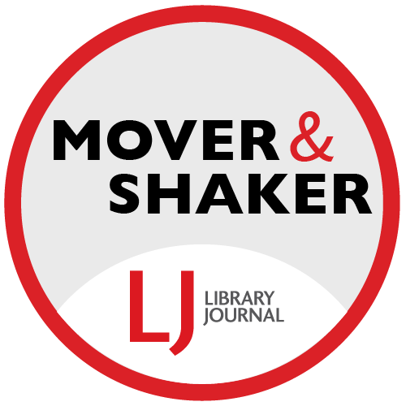

## Welcome!

I am a librarian, data rescuer, and historian. And I row.

This site is a work in progress as we all are. I created this as part of the [Penn State Open Scholarship Bootcamp 2025](https://penn-state-open-science.github.io/bootcamp-2025/), which included a workshop on [Quarto](https://quarto.org).

